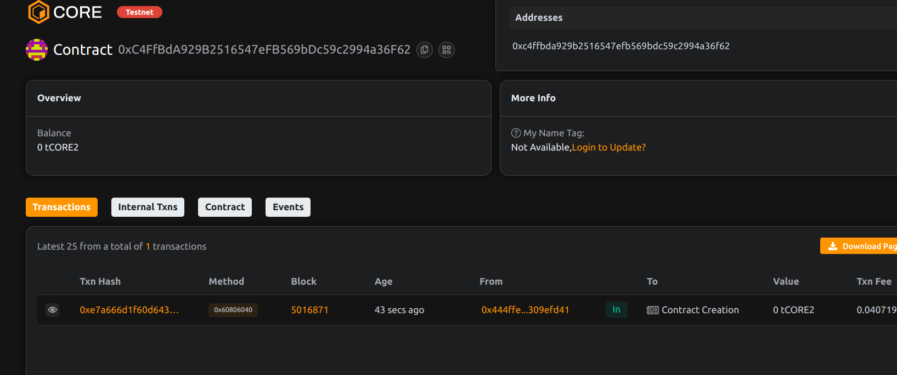

    # Project Title: ChainOptions: On-Chain Derivatives Marketplace

##  Project Description 

ChainOptions is a decentralized platform for creating, trading, and settling options contracts directly on the blockchain. It allows DeFi users to hedge risk or speculate on asset price movements using call and put options — all without intermediaries.

##  Project Vision

To build a fully transparent and composable on-chain options protocol that mirrors traditional financial derivatives while preserving the decentralization ethos of Web3.

##  Key Features

- Creation of call and put options with customizable parameters
- Trustless P2P option contract selling and exercising
- On-chain enforcement of option expiry, strike price, and payout logic
- ERC-20 token-based settlement for compatibility with any DeFi asset

## Future Scope

- DAO-based risk management and fee sharing
- Premium discovery via auction or bonding curve
- Integration with Chainlink oracles for automated price-based settlements
- UI dashboard for visualizing open interest and exercising options

##  Contract Details 
project done by Sejal Verma  

0xC4FfBdA929B2516547eFB569bDc59c2994a36F62
